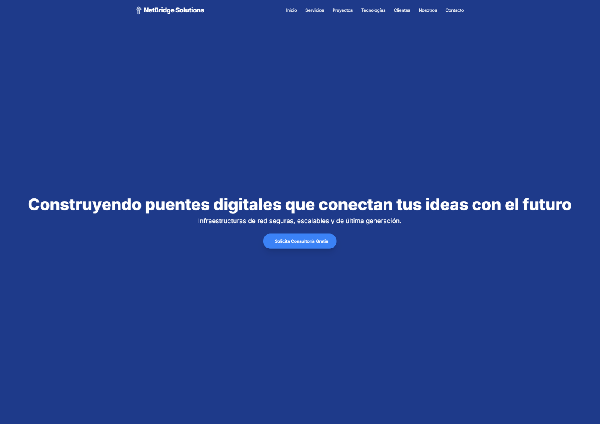
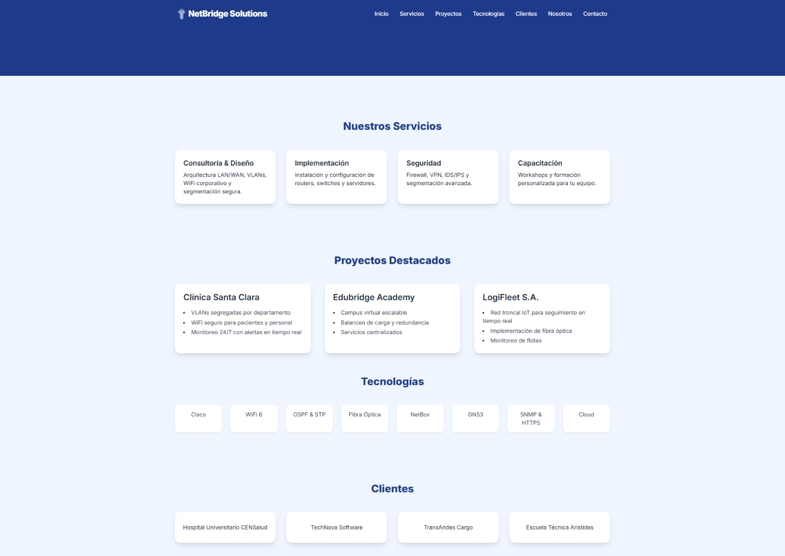
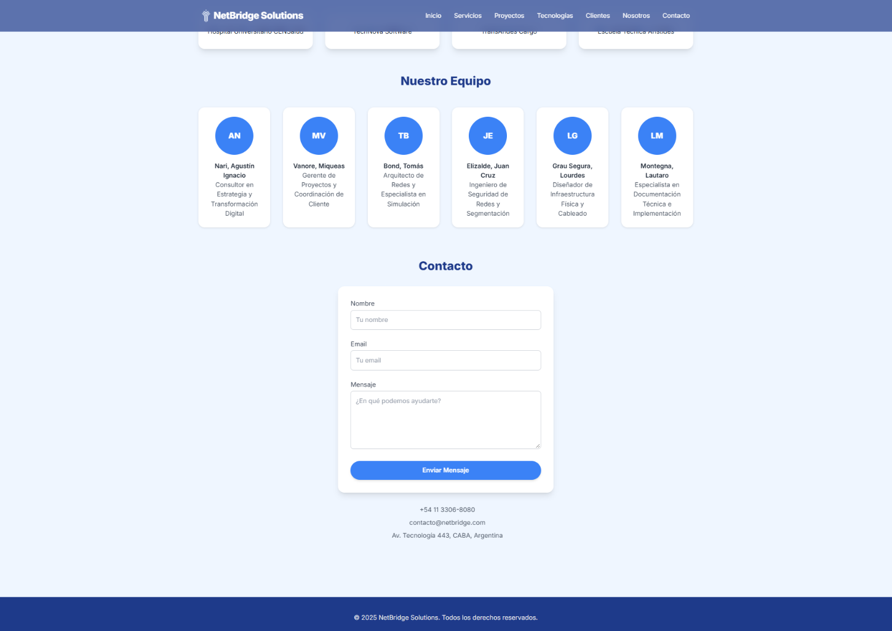

# NetBridge Solutions — Landing Page

Responsive landing-page prototype for a fictional network-infrastructure and IT consulting company.

The site presents services, example projects, technologies, clients, team members, and a contact section.

## Features

- Responsive navigation
- Mobile menu
- Smooth scrolling
- Scroll animations
- Service cards
- Project showcase
- Technology section
- Team section
- Contact form layout
- Responsive desktop and mobile design

## Screenshots

<p align="center">
  <a href="docs/screenshots/home.webp">
    
  </a>
  <br>
  <strong>Home</strong>
</p>

<table>
  <tr>
    <td align="center"><strong>Services &amp; Projects</strong></td>
    <td align="center"><strong>Team &amp; Contact</strong></td>
  </tr>
  <tr>
    <td align="center">
      <a href="docs/screenshots/services-projects.webp">
        
      </a>
    </td>
    <td align="center">
      <a href="docs/screenshots/team-contact.webp">
        
      </a>
    </td>
  </tr>
</table>

## Tech Stack

- HTML5
- Tailwind CSS
- JavaScript
- Font Awesome
- AOS animations
- Smooth Scroll

## Running Locally

No build process is required.

Clone the repository and open:

```text
index.html
```

in a browser.

A local HTTP server can also be used.

For example:

```bash
python -m http.server 8000
```

Then open:

```text
http://localhost:8000
```

## Scope

This repository is a static frontend prototype. Company names, clients, projects, and business information shown on the website are fictional demonstration content.
